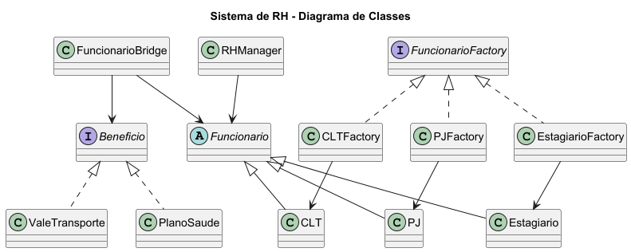

# 📊 Sistema de RH com Padrões de Projeto

Este projeto consiste no desenvolvimento de um **Sistema de Recursos Humanos (RH)** utilizando a linguagem **Java**, com o objetivo de aplicar, na prática, conceitos de **Programação Orientada a Objetos** e **padrões de projeto**.

Foram implementados os seguintes padrões:

* **Singleton**
* **Abstract Factory**
* **Factory Method**
* **Bridge**

O sistema simula a criação e gerenciamento de funcionários, permitindo diferentes tipos de contratação (CLT, PJ e Estagiário), além da associação de benefícios de forma desacoplada.

## 🖼️ Diagrama de Classes



## 🧠 Padrões de Projeto Utilizados

* **Singleton:** Utilizado na classe `RHManager`, garantindo uma única instância responsável pelo gerenciamento dos funcionários.

* **Abstract Factory:** Aplicado na criação das famílias de funcionários através das fábricas (`CLTFactory`, `PJFactory`, `EstagiarioFactory`).

* **Factory Method:** Utilizado na hierarquia da classe `Funcionario`, permitindo a criação de diferentes tipos de funcionários.

* **Bridge:** Aplicado para desacoplar os funcionários dos benefícios (`Beneficio`), permitindo flexibilidade na combinação entre eles.

## 🚀 Tecnologias Utilizadas

* Java
* IntelliJ IDEA
* Maven (gerenciamento de dependências)
* JUnit 5 (testes)

## ▶️ Como Executar

1. Clonar o repositório:

```
git clone https://github.com/Alceu-2004/projeto-quatro-padroes.git
```

2. Abrir o projeto no IntelliJ

3. Executar a classe `Main`

## 🧪 Testes

Para executar os testes:

```
mvn test
```
